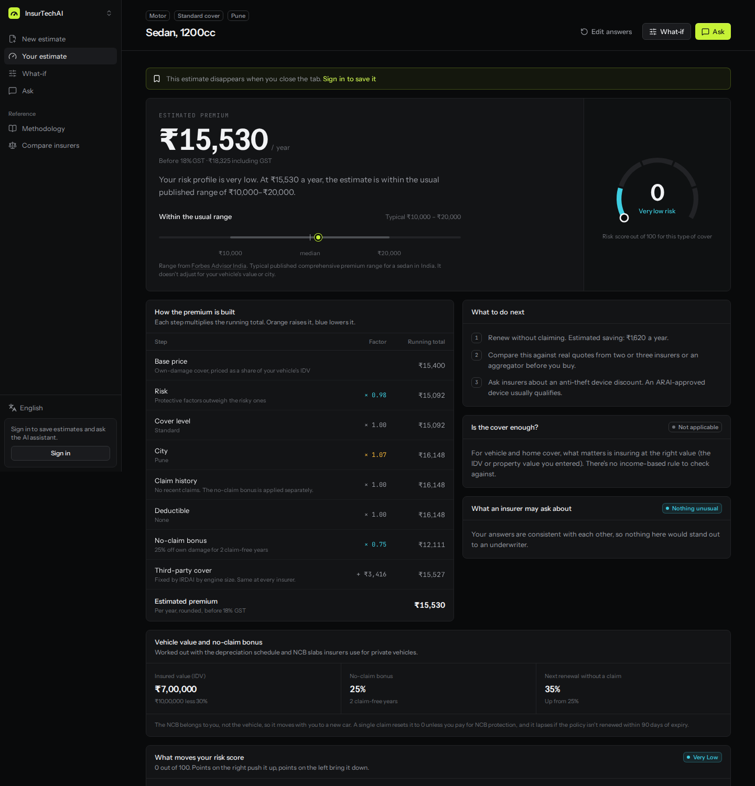
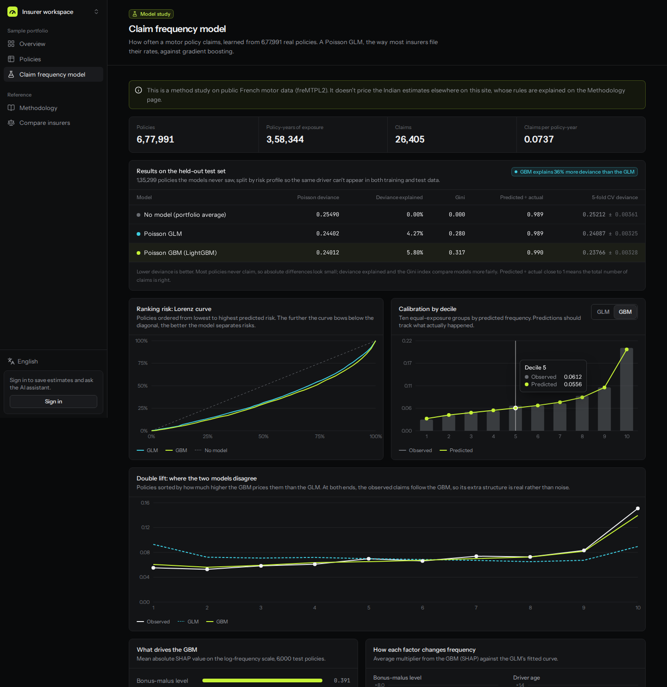
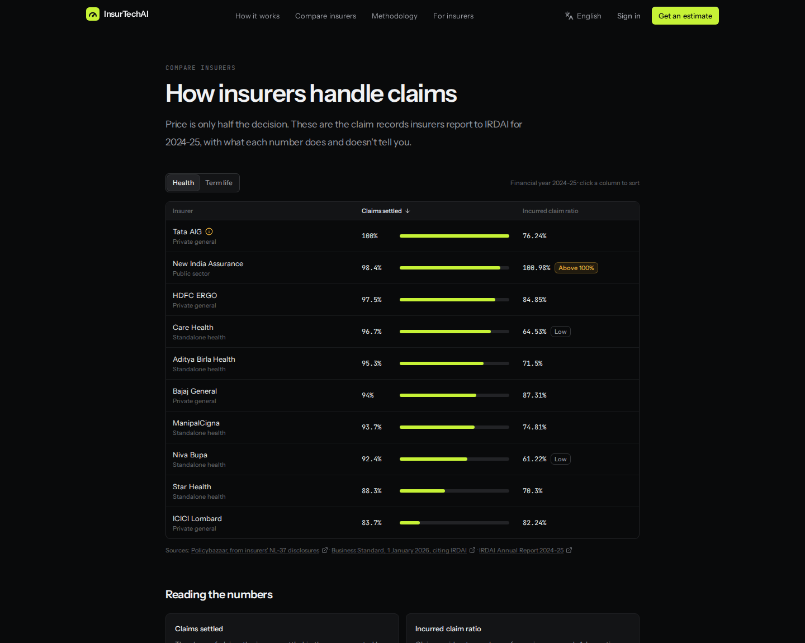
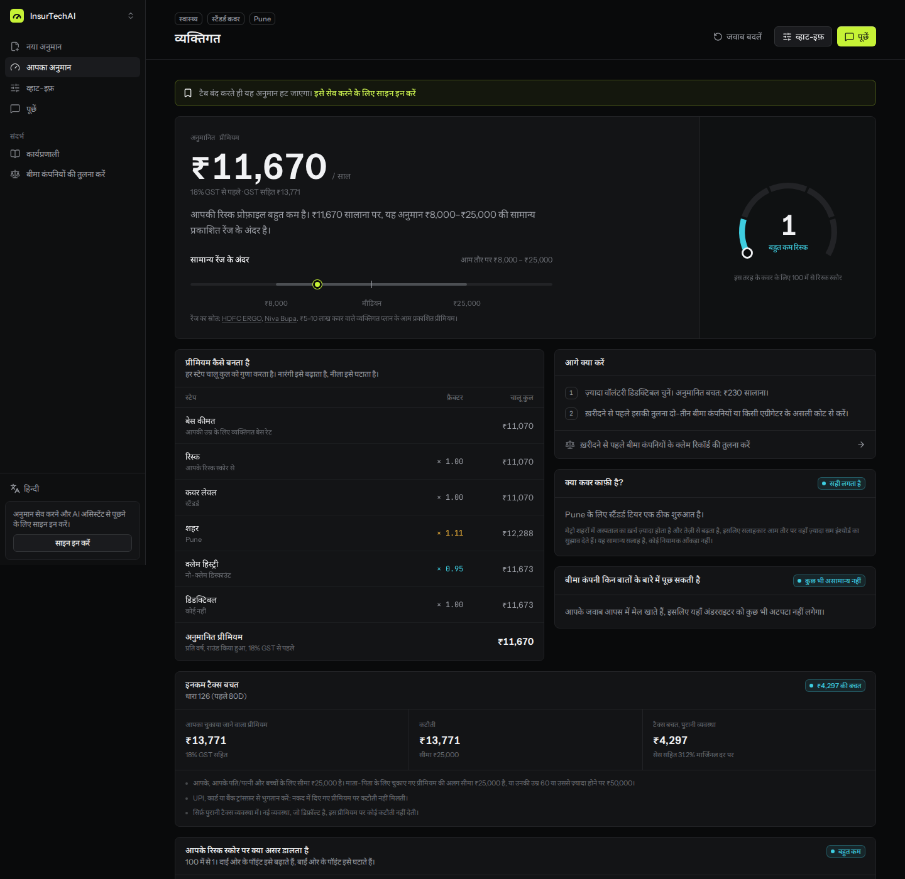
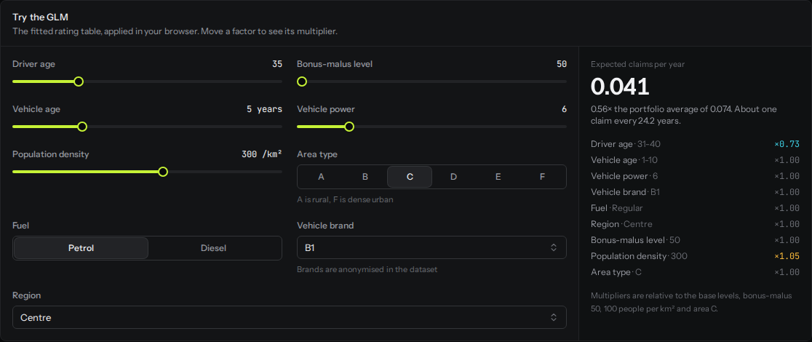
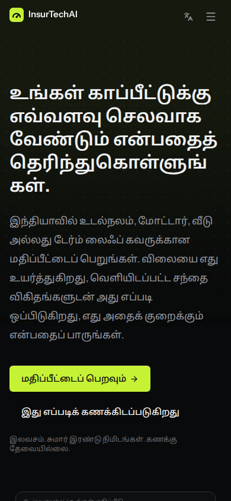
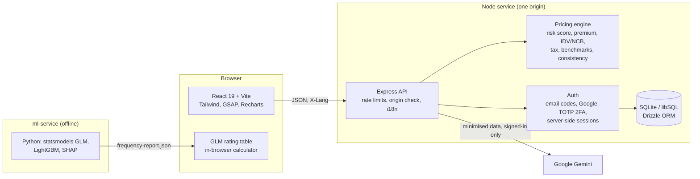

# InsurTechAI

<!-- Replace codewithaymanGIT after pushing, and add the live link once deployed (see DEPLOY.md). -->
[](https://github.com/codewithaymanGIT/insurtechai/actions/workflows/ci.yml)

**Insurance premium estimates for India that show their working**, plus a claim frequency model on 677,991 real
motor policies. React + TypeScript + Express, with a Python/LightGBM modelling pipeline. Available in six languages.



## What it does

- **Estimates** for health, motor, home and term-life cover: an annual premium, the factors behind it, every
  step of the calculation, a comparison with published market ranges, and the changes that would lower it,
  each re-priced for the user.
- **Motor pricing follows the rules insurers use**: IDV from the ex-showroom price and the depreciation schedule,
  no-claim bonus slabs on own damage only, and IRDAI's fixed third-party rates by engine size.
- **Tax saving** on health and term-life premiums under the Income-tax Act, 2025 (Sections 126 and 123,
  formerly 80D and 80C), with the old-regime slabs, rebate, surcharge and cess.
- **Compare insurers**: FY 2024-25 claim settlement and incurred claim ratios, with what each number doesn't tell you.
- **Claim frequency model** (insurer workspace): Poisson GLM against gradient boosting on the freMTPL2 benchmark
  dataset, with the GLM running in the browser as a rating-table calculator.
- **Accounts** with email codes or Google, authenticator-app 2FA, recovery codes and device management.
- **English, हिन्दी, मराठी, தமிழ், తెలుగు, ಕನ್ನಡ**: the interface and the engine's own explanations.

## The claim frequency model

On 677,991 French motor policies (freMTPL2, the standard public benchmark), split 80/20 by risk profile so the
same driver never appears on both sides:

| Model | Test Poisson deviance | Deviance explained | Gini |
|---|---|---|---|
| No model (portfolio average) | 0.25490 | 0.00% | 0.000 |
| Poisson GLM (how insurers file rates) | 0.24402 | 4.27% | 0.280 |
| Poisson GBM (LightGBM) | **0.24012** | **5.80%** | **0.317** |

The GBM explains about 36% more deviance and ranks risk better. On a double-lift chart, where the two models
disagree, observed claims follow the GBM. Method, tuning grid, charts and caveats:
[ml-service/README.md](ml-service/README.md) and [ml-service/reports/REPORT.md](ml-service/reports/REPORT.md).
It's a method study; it doesn't price the Indian estimates.



## Screenshots

| | |
|---|---|
|  |  |
|  |  |



## Architecture



```
frontend/    React app; pages, components, i18n context
backend/     Express API; src/engine (pricing), src/auth, src/i18n.ts; test/ (vitest + supertest)
shared/      types, motor IDV/NCB rules, translation catalogs (used by both sides)
ml-service/  claim frequency study: data, features, models, metrics, train.py, pytest
scripts/     string extraction, catalog build, landing-page sample generator
```

## Design decisions

- **Rules for the Indian estimates, a fitted model only where there's data.** There's no public Indian claims
  dataset, so the consumer pricing is transparent rules calibrated to published premium ranges, and says so.
  Model fitting is shown where real data exists (freMTPL2), with proper validation.
- **Grouped train/test split.** freMTPL2 repeats drivers across rows; a random split leaks them into the test set.
- **GLM next to the GBM.** Insurers file GLM rating tables because regulators and underwriters can audit them.
  Showing both, with the double-lift chart, is the honest comparison.
- **TOTP instead of SMS for 2FA.** No per-message cost, no SIM-swap risk; the implementation is checked against
  the RFC 6238 test vectors, secrets are encrypted at rest and codes can't be replayed.
- **Built-in translations instead of a translate widget.** Widgets rewrite the DOM under React, mistranslate
  insurance terms and can't translate text the server generates. Here the engine writes its explanations in the
  user's language too.
- **One service, one origin.** The API serves the built frontend, which keeps cookies, CSP and CORS simple.

## Run it locally

Needs Node.js 20+ (and Python 3.11+ only for the model).

```bash
npm install
npm run build:shared
npm run db:migrate
npm run seed                # 500 synthetic policyholders for the insurer workspace

npm run dev:backend         # terminal 1: http://localhost:4000
npm run dev:frontend        # terminal 2: http://localhost:5173
```

Copy `backend/.env.example` to `backend/.env` first. Everything works with the defaults; without SMTP settings,
email sign-in codes print in the backend terminal.

## Tests

```bash
npm run typecheck     # backend + frontend
npm test              # 49 backend tests (engine, tax, RFC 6238, full sign-up + 2FA flow) + 21 frontend tests
cd ml-service && pytest
```

GitHub Actions runs all of these, plus the translation-catalog check and a production build, on every push.

## Configuration (`backend/.env`)

| Variable | Needed for | Notes |
| --- | --- | --- |
| `AUTH_SECRET` | Production | 32+ random characters. `node -e "console.log(require('crypto').randomBytes(32).toString('hex'))"` |
| `APP_ORIGIN` | Always | The site's URL(s), comma-separated. Used for CORS and cross-site request checks. |
| `DATABASE_URL`, `DATABASE_AUTH_TOKEN` | Hosting | A local file by default; a `libsql://` URL (e.g. Turso) on hosts without persistent disk. |
| `ADMIN_EMAILS` | Optional | Emails that get the admin role (site usage page). |
| `GOOGLE_CLIENT_ID` | Google sign-in | OAuth client ID (Web application) with your site under Authorised JavaScript origins. |
| `SMTP_HOST`, `SMTP_PORT`, `SMTP_USER`, `SMTP_PASS`, `EMAIL_FROM` | Email codes in production | Gmail works with an app password. |
| `GEMINI_API_KEY` | AI chat | From https://aistudio.google.com/apikey. Never commit it or paste it anywhere public. |
| `GEMINI_PAID_TIER` | AI chat | `true` once billing is enabled on the key's project (free-tier content may be used by Google). |
| `CHAT_DAILY_LIMIT` | AI chat | Questions per user per 24 hours (default 40). |
| `TRUST_PROXY` | Production | `1` behind a load balancer or reverse proxy. |

## Security

- Sessions: random 256-bit token in an httpOnly, SameSite=Lax cookie (`__Host-` prefixed and Secure in
  production); only its SHA-256 hash is stored. 30-day sliding expiry.
- Email codes: 6 digits, HMAC-hashed at rest, 10-minute expiry, single use, 5 wrong attempts invalidates the
  code, 60-second resend cooldown, 5 codes per email per hour.
- Two-factor sign-in with any authenticator app (RFC 6238, ±30 s, replay-blocked). The secret is AES-256-GCM
  encrypted at rest; 10 single-use recovery codes are stored hashed. Users can see and sign out other devices.
- Rate limits on all API routes, stricter ones on sign-in and 2FA, and a daily quota on AI chat.
- Origin check on state-changing requests; Helmet headers with a CSP that allows only Google's sign-in script.
- Visitor estimates are stored only for signed-in users. The insurer workspace reads only synthetic data.
- The AI assistant receives minimised data only (age band, city, cover and computed numbers; no name, email,
  exact age, income or condition names).

## Translations

UI and engine text are keyed on the English sentence (gettext style) with `{placeholders}`; anything missing
falls back to English.

```bash
npm run i18n:extract    # scans t()/tr()/N_() calls -> scripts/i18n/source.json
# add translations for new keys to scripts/i18n/<lang>/*.json
npm run i18n:build      # checks placeholders and coverage, writes shared/src/i18n/catalogs/<lang>.ts
npm run landing:sample  # regenerates the landing-page example in every language from the engine
```

The five Indian-language catalogs were drafted with AI assistance using a fixed glossary. They need review by
native speakers, especially the Terms and Privacy text, before public launch.

## Deploy

One Node service with a hosted SQLite database: see [DEPLOY.md](DEPLOY.md) for Render + Turso (free) and Docker.

## Known limitations

- The Indian risk weights and city ratings are set by hand, not fitted to claims data (none is public).
- Market ranges are broad published figures, not live quotes, and sources differ on GST.
- The insurer portfolio is synthetic; the frequency model is on French data from the 2000s and models frequency only.
- Tax savings assume salaried income, the old regime and no other deductions.
- Insurer claim figures are one financial year from secondary compilations of IRDAI data; update them yearly
  in `frontend/src/lib/insurers.ts`.

It's an estimate tool, not an insurer or IRDAI-registered intermediary. Nothing it produces is a quote.

