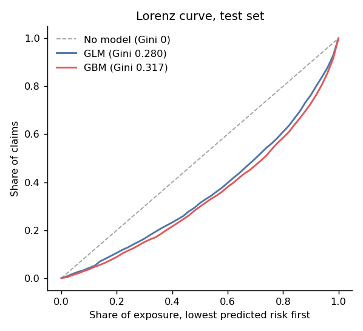
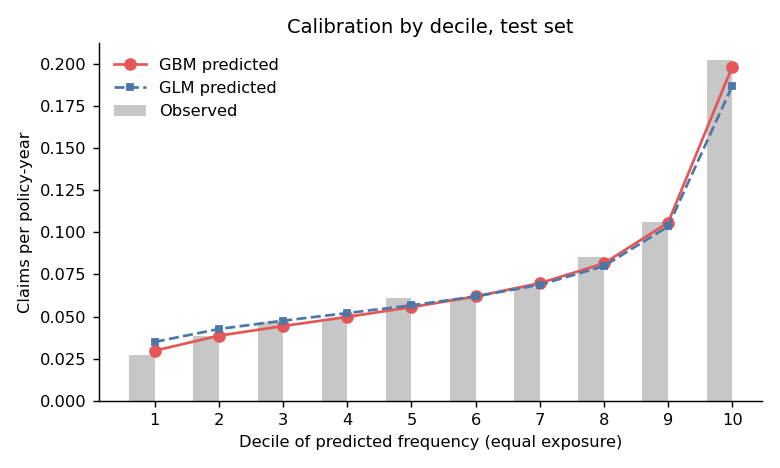
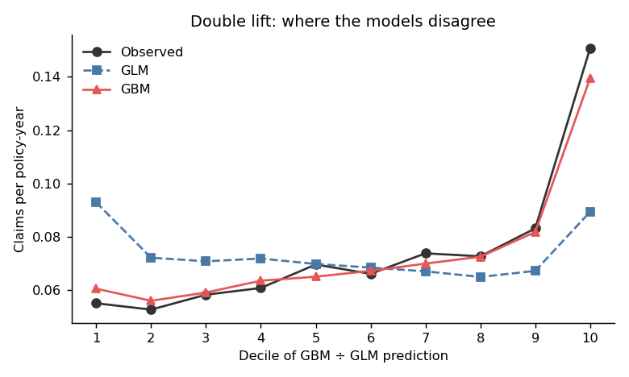

# Claim frequency model: GLM vs gradient boosting on freMTPL2

Generated by `train.py` on 2026-09-26.

## Data
- **freMTPL2freq** (CASdatasets): 677,991 French motor TPL policies, 358,344 policy-years, 26,405 claims, portfolio frequency 0.0737 claims per year.
- Cleaning: exposure capped at 1 year, claim count at 4, vehicle age at 20, driver age at 90, bonus-malus at 150.
- Split: 80/20 split by risk profile (rows with identical rating factors stay together), seed 42. Train 542,692 / test 135,299 policies. The test set was scored once, after all tuning.

## Models
All three predict expected claims with log(exposure) as an offset.
1. **Null**: portfolio average frequency for everyone.
2. **Poisson GLM**: banded driver age, vehicle age and power, bonus-malus (linear + log), log density, area (ordinal), brand, fuel, region. This is how most insurers file rates.
3. **Poisson GBM** (LightGBM): capped raw variables, monotone increasing in bonus-malus, early stopping on a validation split of the training data.

## Results (test set)

| Model | Mean Poisson deviance | Deviance explained | Gini | Predicted ÷ actual claims | 5-fold CV deviance |
|---|---|---|---|---|---|
| No model (portfolio average) | 0.25490 | 0.00% | 0.000 | 0.989 | 0.25212 ± 0.00361 |
| Poisson GLM | 0.24402 | 4.27% | 0.280 | 0.989 | 0.24087 ± 0.00325 |
| Poisson GBM (LightGBM) | 0.24012 | 5.80% | 0.317 | 0.990 | 0.23766 ± 0.00328 |

## GBM tuning (validation split inside training data)

| num_leaves | min_data_in_leaf | rounds | validation deviance |
|---|---|---|---|
| 15 | 300 | 279 | 0.24159 |
| 15 | 1000 | 273 | 0.24152 |
| 15 | 3000 | 299 | 0.24147 |
| 31 | 300 | 230 | 0.24159 |
| 31 | 1000 | 213 | 0.24157 |
| 31 | 3000 | 212 | 0.24153 |
| 63 | 300 | 181 | 0.24178 |
| 63 | 1000 | 186 | 0.24168 |
| 63 | 3000 | 181 | 0.24157 |

## What drives the GBM (mean |SHAP| on log-frequency, 6,000 test policies)

| Feature | Mean abs. SHAP |
|---|---|
| Bonus-malus level | 0.391 |
| Driver age | 0.139 |
| Population density | 0.089 |
| Vehicle age | 0.086 |
| Region | 0.076 |
| Fuel | 0.075 |
| Vehicle brand | 0.071 |
| Vehicle power | 0.038 |
| Area type | 0.014 |

## Caveats
- French data from the 2000s. It demonstrates the method; the relativities don't apply to Indian motor pricing.
- Frequency only. A full technical price also needs a severity model (claim cost), expenses and loadings.
- Deviance differences look small because most policies have no claim; relative gains and the Gini are the fairer comparison.
